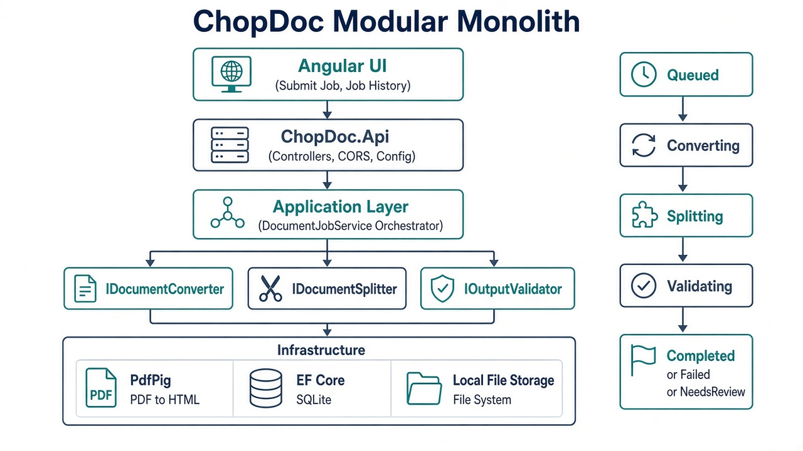

# Architecture

Also available as vector: [`architecture-overview.svg`](./architecture-overview.svg)

## Is this the best architecture?

**For this assessment and problem size: yes — a modular monolith is the strongest choice.**

| Option | Verdict |
|--------|---------|
| **Modular monolith (what we built)** | Best fit: clear SOLID boundaries, easy live demo, deep tests on convert/split/validate |
| Microservices (convert / split / validate as separate services) | Over-engineered here: network/ops cost without scale or team-boundary drivers |
| Single-project “all in one file/folder” | Too weak for a senior evaluation of boundaries |
| Full CQRS / event sourcing | Extra ceremony; little benefit for one synchronous pipeline |

“Best architecture” always means **best for the constraints**. DigiArenas asked for architectural judgment, depth on edge cases, and a demo you can run live — not distributed systems theatre.

### What “modular” means here

One deployable (.NET API) with projects:

- **Api** — HTTP only  
- **Application** — orchestration (`DocumentJobService`)  
- **Domain** — entities, status transitions, exceptions, interfaces  
- **Infrastructure** — PdfPig, EF Core/SQLite, disk storage, splitter/validator implementations  

Convert / split / validate are **separate services behind interfaces**, not separate microservices.

### Evolution path (say this in the interview)

If conversion becomes slow or CPU-heavy: extract a **background worker** first.  
Only split into separately deployable services if scaling or team ownership forces it.
